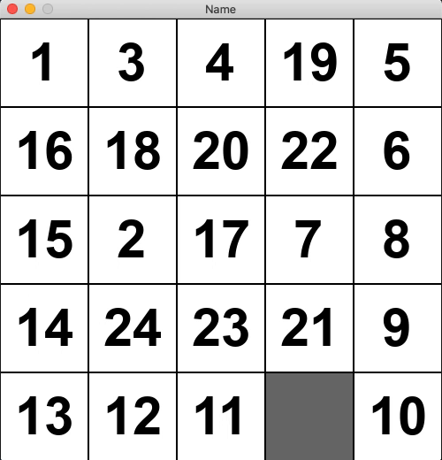

# NPuzzle Solver

Solving the NPuzzle using the A* algorithm



## Install Pygame

Use the package manager [pip](https://pip.pypa.io/en/stable/) to install Pygame

```bash
python3 -m pip install -U pygame --user
```

## Run
n will be the size of the puzzle and has to be a number between 2-5
```bash
python main.py <n>
```
## Controls

Space - start/restart solving

R - reshuffle the puzzle
